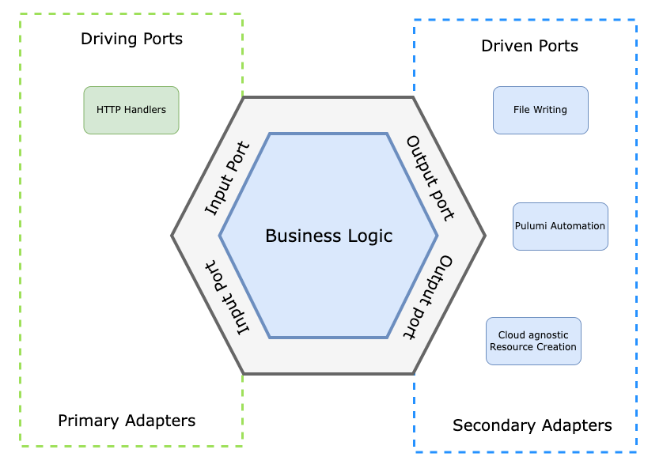

# Pulumi Automation Demo

## Architecture

Designed with the principles of hexagonal architecture, also known as ports and adapters, this application prioritizes flexibility, maintainability, and ease of adaptation to changes, ensuring long-term efficiency and scalability.




## Pulumi State

This project utilizes the local filesystem in order to store state, but it also works with Pulumi Cloud out of the box, [click here](https://www.pulumi.com/docs/concepts/state/) for more information.

---

### **1. Set Up AWS Account**

First, if you haven't already, create a personal AWS account. You'll then need to set up an IAM user or role with the necessary permissions for the resources you want to manage with Pulumi.

### **2. Download AWS CLI**

```bash
# For macOS with Homebrew:
brew install awscli

# For other platforms, follow the official AWS instructions:
# https://aws.amazon.com/cli/
```

### **3. Configure AWS Credentials**

After setting up your AWS account, configure your AWS credentials locally. You can do this in several ways:

- Create IAM User
- Create Access Key for that user (CLI use case)
- **AWS CLI**: Use the AWS CLI and run **`aws configure`** to set up your credentials. Pulumi will use these credentials by default.


### **4. Configure Pulumi Access Token**

You’ll need a Pulumi access token so that your programs can store the resulting state in the Pulumi Cloud. The easiest way to obtain a token is to run ``pulumi login`` from the command line.

### **5. Run the program!**

Due to the automated nature of the program, it is not needed to run **`pulumi up`** through the CLI to preview and deploy your AWS resources. 

See attached Postman Collection covering the majority of use cases.

---

### Dev Guidelines

#### Design with multi-cloud in mind

Avoid names like ``S3BucketPort`` when you could easily use something like ``Storage Port``

Here's an overview of the services provided by each major provider:


---

### Useful links

- [Pulumi AWS docs](https://www.pulumi.com/docs/clouds/aws/)
- [Documentation for the automation API](https://www.pulumi.com/automation/)
- [Automation API examples](https://github.com/pulumi/automation-api-examples/tree/main)